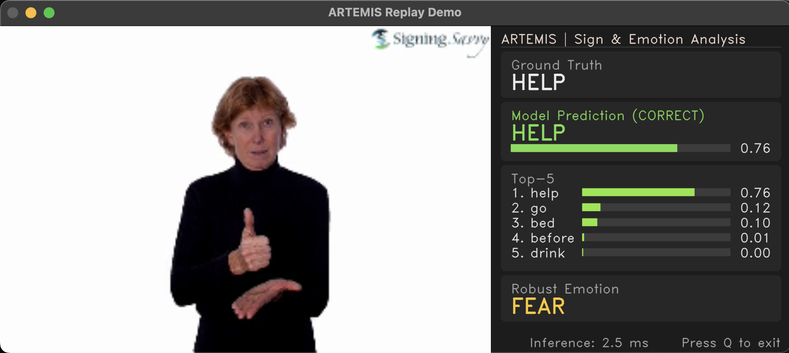

 

# ARTEMIS: Real-Time Sign Language & Emotion Classification

## Project Status: In Development

This repository contains the code, models, and experimental results for my capstone project. The goal is to build a real-time pipeline for classifying American Sign Language gestures and detecting user emotions from a live webcam feed.

This repository serves as a living document of the development process, showcasing the progress, challenges, and iterative improvements made along the way.

## Project Overview

The ARTEMIS system integrates three core machine learning components:
1.  **A custom-trained YOLOv8 model** for robust detection of the signer.
2.  **A pre-trained GRU-based sequence model** for classifying sign language gestures.
3.  **A pre-trained Transformer model** from Hugging Face for analyzing facial emotion.

## Current Progress Snapshot

The image below shows the current state of the live demo. The pipeline successfully integrates all models and performs real-time keypoint extraction, object detection, and emotion classification. The intelligent "wrapper" logic (confidence thresholding and prediction smoothing) is in place to provide a stable user experience.

The primary remaining challenge is a classic **training-serving skew** with the sign classifier. The immediate next step is to retrain the classifier on a new, correctly processed dataset (like WLASL) to resolve this skew.

## How to Run the Demo

1.  Clone the repository.
2.  Install dependencies using Poetry: `poetry install --no-root`.
3.  Run the final demo script: `poetry run python scripts/live_demo_stable.py`.
